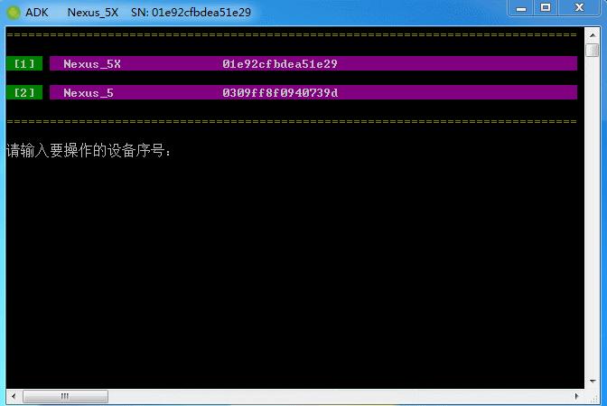
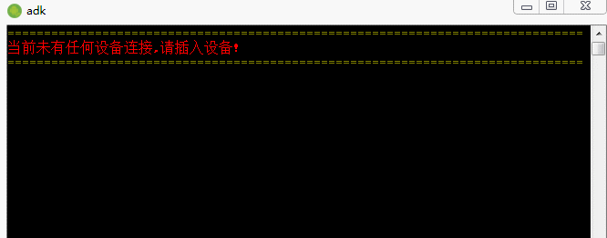
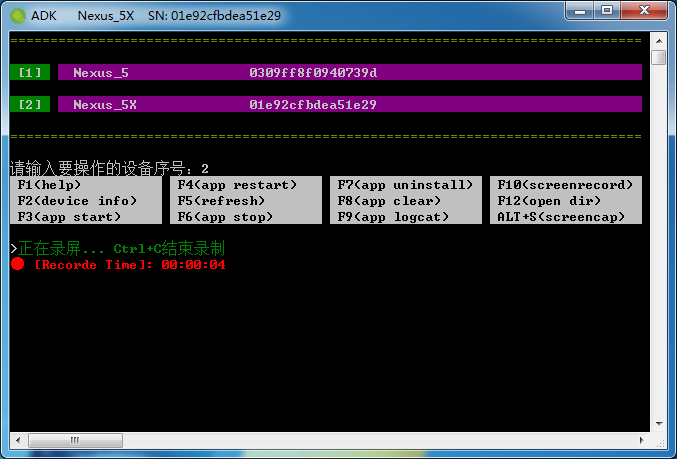
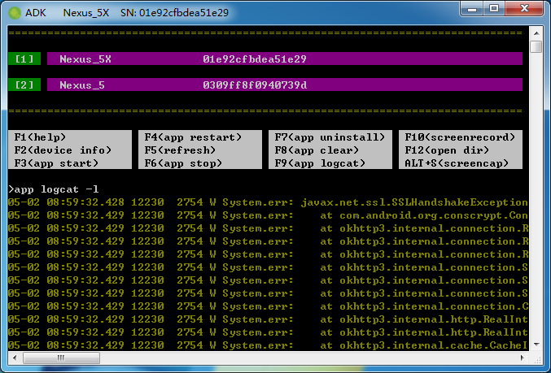
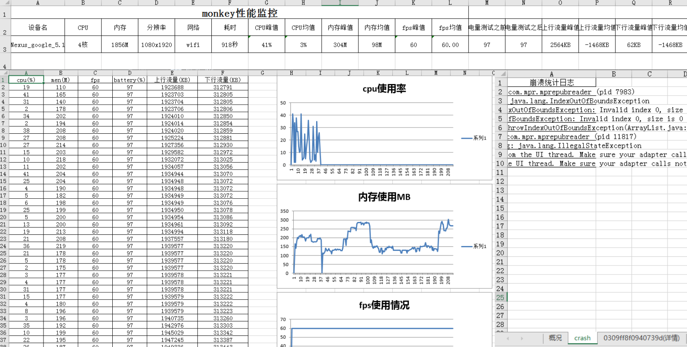

# Android Debug Keyboard
Android Debug Keyboard(下面简称ADK)是一款安卓 APP 测试辅助工具，可快速截图、录屏、查看设备信息、应用信息、日志及安装、卸载、monkey测试等功能，主要是方便做安卓软件测试的同学，发现Bug、更快地提交Bug。
[工具下载](https://github.com/mocobk/Android-Debug-Keyboard/releases)
## 工具预览

## 功能简介
1. 支持多设备连接，查看设备信息、应用信息；
1. 支持命令自动补全、类Linux命令输入；
1. 快速安装apk包，安装后自动启动应用；
1. 快速启动应用、停止应用、重启应用、清理数据、卸载应用；
1. 全局截屏并在windows中使用默认图片查看器打开；
1. 一键录屏，并获取；
1. 实时查看指定应用的logcat日志，并高亮显示Warning、Error级别日志；
1. 完整的Monkey测试，并生成日志及Excel图表报告；
1. 更多功能待续...

## 使用方法
使用前请确保安装好adb工具，并配置好环境变量，这个不懂的同学自行google、百度了，这里也扔个链接吧，[传送门](https://jingyan.baidu.com/article/17bd8e52f514d985ab2bb800.html)。

### 连接设备
打开ADK工具，未插入设备前是处理等待设备连接状态
插入设备后工具会自动连接，当前只有一个设备时会直接进入命令行模式，有多个设备时会显示设备列表并提供选择设备

### 查看帮助
进入命令行模式后会显示常用的快捷键，按F1或在命令行中输入help命令显示所有帮助
    
    >help
    -------------------------------------------------------------------------------
      Android Debug Keyboard V1.1   @mocobk
    -------------------------------------------------------------------------------
      F1                      常用快捷键帮助
      F2                      显示设备信息 -机型 -系统版本 -分辨率 -IP
      F3                      快速启动指定的APP
      F4                      重启APP
      F5                      重启并刷新设备列表
      F6                      结束APP进程
      F7                      卸载APP
      F8                      清除APP数据、缓存
      F9                      查看APP实时日志
      F10                     录屏
      F11                     查看当前app信息
      F12                     打开文件保存目录
      Shift+Tab               按顺序切换已连接的设备
      Ctrl+A                  显示当前APP信息
      Ctrl+W                  切换设备连接方式，USB | WIFI
      Ctrl+P                  显示APP包名，未指定时默认显示当前APP
      命令模式：
      adb                     运行adb命令
      apk_path.apk            安装apk，支持http、ftp、samba
      app clear               清除APP数据、缓存
      app info                显示APP信息 -包名 -版本号 -包路径
      app logcat              查看APP实时日志，加参数 -l 高亮显示
      app restart             重启APP
      app start               快速启动指定的APP
      app stop                结束APP进程
      app uninstall           卸载APP
      cls                     清屏
      device info             显示设备信息 -机型 -系统版本 -分辨率 -IP -设备序列号
      exit                    退出程序
      help                    显示所有帮助
      input                   输入文本内容到设备，暂不支持中文
      monkey                  运行monkey测试，加参数 -r 重复上一次的monkey测试
      open dir                打开文件保存的目录
      package name            显示APP包名，未指定时默认显示当前APP
      refresh                 重启并刷新设备列表
      screencap               截图
      screenrecord            录屏
      set app[ package_name]  指定调试APP包名，不填包名，默认为当前APP
      set hotkey              设置截图全局热键 set hotkey CTRL+Q; set hotkey ALT+Q
      switch connect          切换设备连接方式，USB | WIFI
    -------------------------------------------------------------------------------

### 安装应用
直接输入apk的存放路径或拖拽apk包到工具中，按回车即可安装，支持从http、ftp、samba共享文件夹地址中安装，安装后应用会自动打开。

### 调试应用
设置需要调试/测试的应用包名，不输入包名时会自动设置为当前打开的应用

    >set app com.mpr.mprepubreader
启动应用、停止应用、重启应用、清理数据、卸载应用,也可以使用相应的快捷键操作

    >app start
    >app stop
    >app restart
    >app clear
    >app uninstall
    
### 快速截图
ADK默认使用ALT + S全局热键截图,若与其他程序热键冲突可使用`set hotkey`命令重置

### 快速录屏
按F10可快速对设备屏幕进行录屏，按Ctrl + S结束录屏后，可按F12打开视频文件所有目录

### 查看应用日志
按F9可实时查看已设置的应用或当前应用的运行日志，测试时当应用出现崩溃时可输入 `app logcat -l` 高亮显示崩溃日志信息

### 运行monkey测试

设置monkey命令并运行monkey测试

    >monkey
重复上一次的monkey测试

    >monkey -r
测试结束后可按F12打开报告所在的文件夹

### 小技巧
1. 输入命令时按上、下键选择历史命令
1. ctrl+u/ctrl+k 分别从光标处向前或向后批量删除命令字符串 
1. ctrl+a/ctrl+e 分别将光标移动到命令最前或最后
1. 多个设备时可按Shift + Tab来回切换
1. Ctrl + W 可切换使用USB连接或WIFI连接设备，默认使用USB连接，截图速度更快

目前还有一些异常没考虑到或某些系统版本未兼容，欢迎提交[Issues](https://github.com/mocobk/Android-Debug-Keyboard/issues)，希望能为安卓测试带来更多便捷！

联系作者：mailmzb@qq.com
